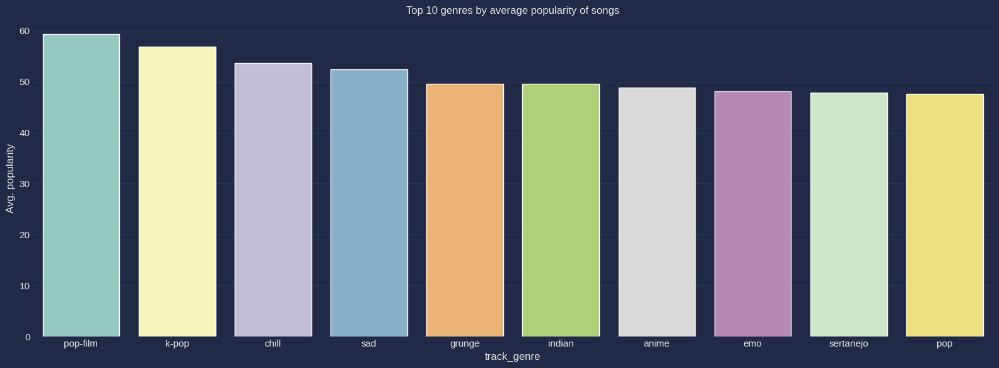
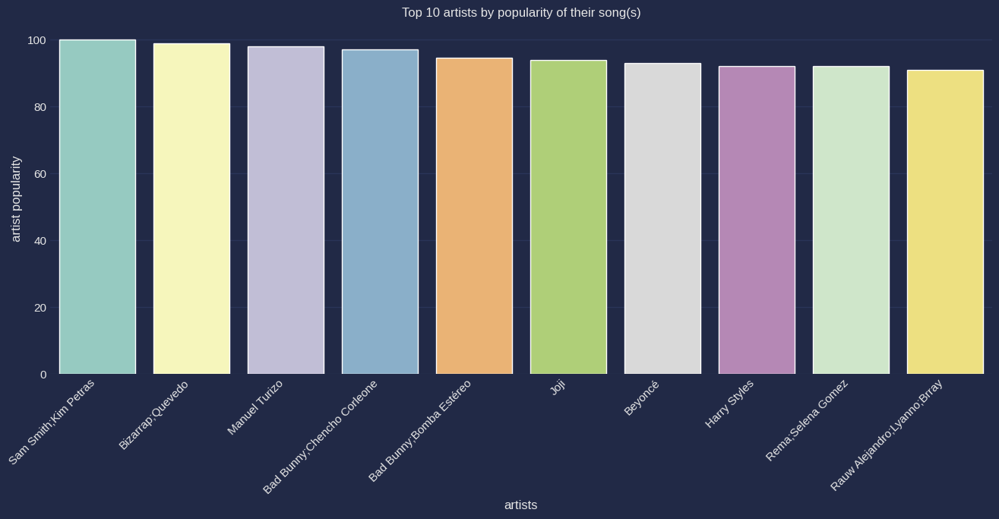
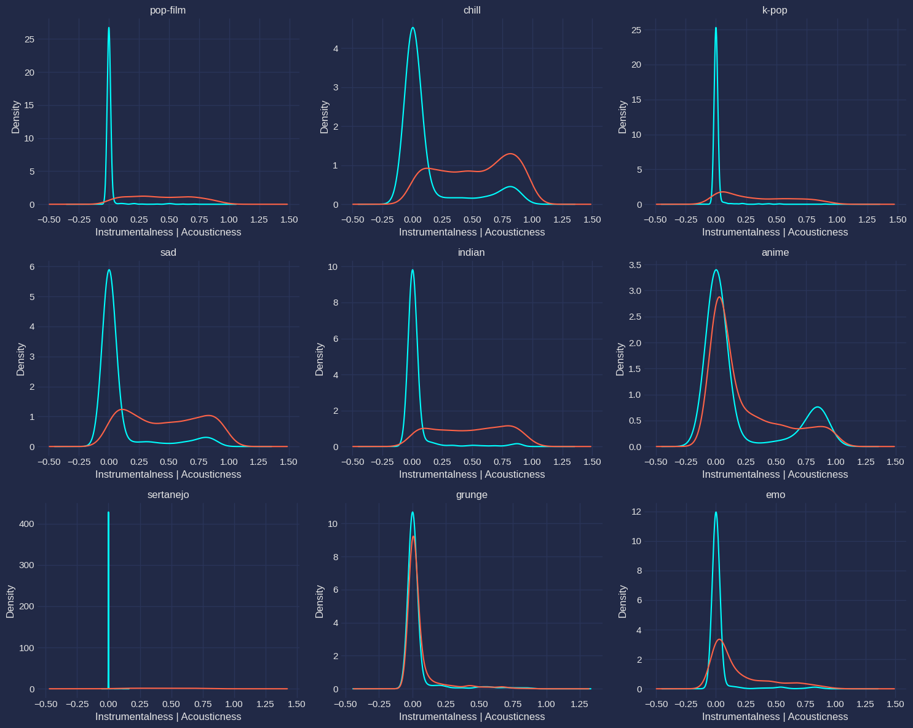
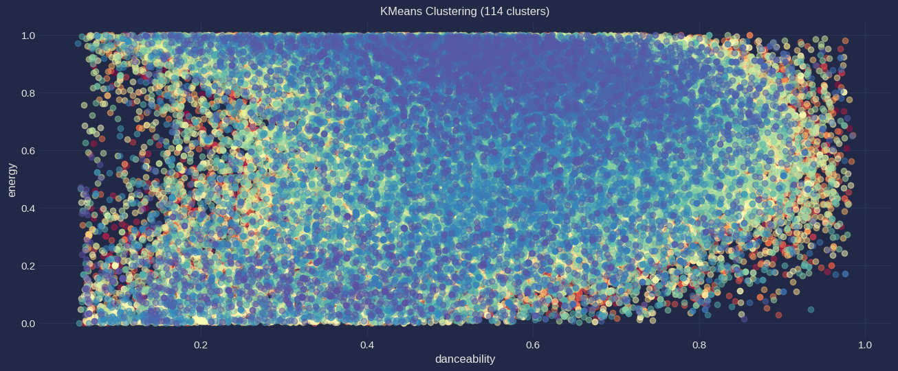
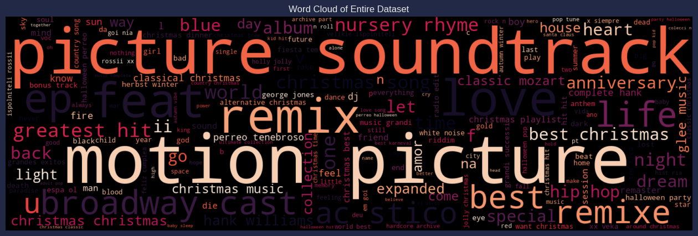
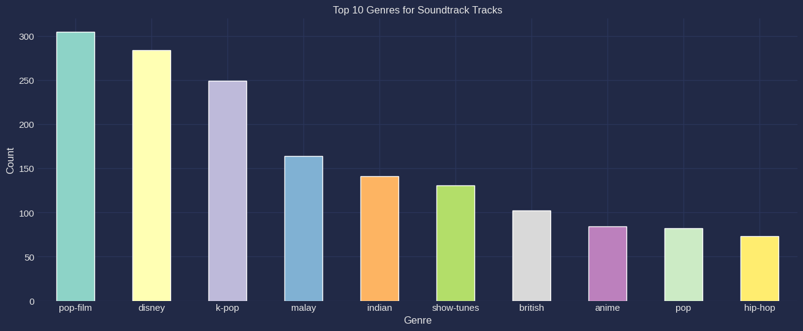
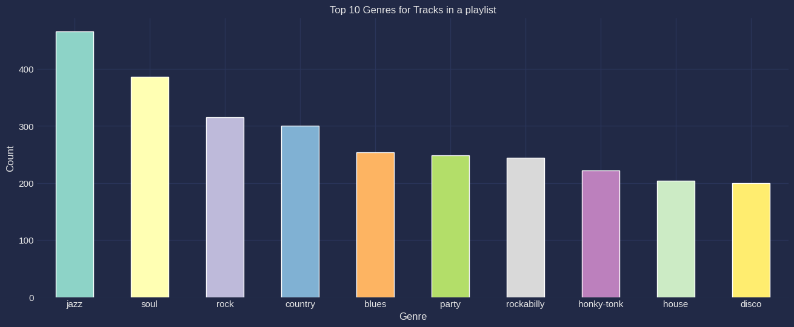

# Popularity score of music tracks
### Team members: Adib Menchali, Lorenzo Conti

## Introduction:
The project aims to explore music features and predict track popularity to provide insight and recommendations to rising artists. 

The objectives of the project are as follows:

• Collecting insights about the drivers of music popularity.  
• Implementing clustering to separate and identify track genres.  
• Predicting track popularity based on song features.  
• Providing recommendations to artists and music producers.  

## Methods:
• Our whole project was done on Colab.  
• Latent Dirichlet Allocation: Used for Topic Modeling.  
• K-Means: Used to cluster the data.  
• Adjusted Rand Index: Assess the K-Means clustering results.  

## Experimental Design
### Feature Engineering:
• To leverage our dataset as much as possible, we extracted new features from the artists and genre columns. This enabled us to use make use of both variables and deal with the challenge of having to encode them later on which wasn't an option given that the columns had way too many classes to encode. Therefore, we extracted Artist_influence and Genre_influence tracks where we stored the average Popularity for each artist and genre respectively.  
• We conducted NLP on album names to see if it's possible to conduct topic modeling on the album_name feature. This helped us discover that a lot of our albums were actually playlists or soundtracks. We extracted 2 new binary variables for Playlist and Soundtrack to explore them separately.  
• We also extracted a new feature called 'Featuring' that takes as values True if the track has more than one artist and False otherwise.

### Clustering:
To see if it's possible to identify different genres with a clustering algorithm, we used k-means with k=114. We then evaluated our clustering results using ARI to measure the degree of alignment between the k-means output and the Genre column.

### Models:
The main thing we noticed when we were building the model (mostly thanks to the correlation matrices we produced) is that artist popularity is the biggest factor for determining the popularity of a track which we thought would hinder us from extracting any useful findings from the models. For this reason, we decided to build models with 2 different approaches: The first one includes all the dataset (post-processed data) and the second approach filters out the very popular tracks from the dataset to reach a threshold that minimizes the correlation between artist_influence and popularity (we chose popularity < 10 after visualizing correlation matrices with different potential thresholds).
The different algorithms we used are Linear Regression, Random Forest, and XGBoost. For the 2nd approach, we also tried using an ANN.

To evaluate the models we looked at MSE, RMSE, and R-squared.
 MSE and RMSE quantify the average squared difference between predicted and actual popularity scores, providing a comprehensive assessment of model performance. RMSE, being the square root of MSE, allows for direct comparison with the target variable and enhances interpretability. R-squared measures the proportion of variance explained by the model, offering an overall evaluation of predictive power.

## Results:

**Most popular genres:**

**Most popular artists:**

**Identifying different genres based on the distribution of their features:**

**K-means Result:**
  
The overlap of audio features across different genres makes it difficult to 
identify Genres solely based on the distribution of the most notable
variables. This explains how challenging it is for a clustering algorithm like 
K-means to capture the true structure of the data.

**Generated wordcloud based on topic modeling results:**

Based on these results, we noticed that some of the albums in the dataset are actually playlists/soundtracks.

**Most popular genres featured in soundtracks:**

**Most popular genres added to playlists:**

## Conclusion:

The findings reveal a challenge posed by the limited predictive power of music features in determining song popularity. This limitation arises from the overlap of audio features across different tracks and genres. Interestingly, artist influence and genre influence emerge as the most significant predictors of popularity. Among the popular genres utilized in soundtracks, pop-film, Disney, and K-pop stand out. On the other hand, jazz, soul, and rock are the most frequently added genres to playlists. An intriguing observation is that less popular tracks tend to be included in more playlists as part of marketing strategies. Based on these insights, up-and-coming artists are advised to consider producing pop-film, chill, or sad songs to enhance their chances of success. We also found that songs that feature more than one artist tend to be more popular so that is something to consider for rising musicians.
For future research, it might be more useful to include mainly tracks from the underground scene to explore popularity from another scale that is not overshadowed by extremely popular artists.